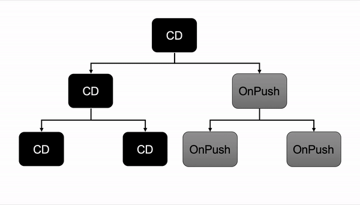

# Change Detection in Angular

## Change Detection
Az a folyamat, amikor az Angular ellenőrzni a változásokat az összes nézetben.

## Működése
Az Angular egy fa struktúrát épít a nézetekből és minden változás esetén 
bejárja azt felülről lefelé. Nem végez mély összehasonlítást az objektumokon, csak a sablonokban használt tulajdonságok jelenlegi és előző értékét hasonlítja össze. ===  
  
  

## Zone.js
Ez felel a változások követéséért. Két állapota, fázisa van a 
működésének:  
- stable: amikor indul
- unstable: amikor valamilyen feladat fut a zónában
- stable: a feladatok futása után ismét visszatér stable állapotba  
> A következő esetekben történik chenge detection:
- Browser event: (click, keyup, stb.)
- setInterval(), setTimeout()
- XMLHttpRequest

## Change Detection Strategies
Két stratégia van a változások követésére:
- Default
- OnPush

__ChangeDetectionStrategy.Default:__ minden komponenst ellenőriz a komponens fában felülről lefelé, minden alkalommal amikor azt valamilyen esemény elindítja. Ezt 
__dirty checking__ -nek is nevezik. Ez nagyban lassíthatja a nagyméretű alkalmazásokat.  

__ChangeDetectionStrategy.OnPush:__ át tudjuk állítani a change detection -t a komponens dekorátorban a másik módszerre:  
`
@Component({
    selector: 'hero-card',
    changeDetection: ChangeDetectionStrategy.OnPush,
    template: ...
})
`  
Ez kihagyja a komponens és a gyermek komponensek felesleges ellenőrzését:  

  
  
Ha ezt a stratégiát használjuk, akkor az Angular csak a következő esetekben ellenőriz:  
- Az @Input() referencia megváltozik
- A komponens vagy valamelyik gyereke eseményt vált ki
- A change detection manuálisan kerül indításra: `ChangeDetectorRef.detectChanges()` vagy `ApplicationRef.tick()`
- Egy observable ami async pipe -al van bekötve, új értéket ad
  
## ChangeDetectorRef methods

  

## Futtatás Change Detection nélkül
`
constructor(private ngZone: NgZone) {}

runWithoutChangeDetection() {
  this.ngZone.runOutsideAngular(() => {
    // the following setTimeout will not trigger change detection
    setTimeout(() => doStuff(), 1000);
  });
}
`

## Deaktiválás és manuális futtatás
`
constructor(private ref: ChangeDetectorRef) {
  ref.detach(); // deactivate change detection
  setInterval(() => {
    this.ref.detectChanges(); // manually trigger change detection
  }, 10 * 1000);
}
`

## Hasznos linkek
- [ChangeDetectorRef class](https://angular.io/api/core/ChangeDetectorRef)
- [Guide for angular change detection](https://www.mokkapps.de/blog/the-last-guide-for-angular-change-detection-you-will-ever-need/)
